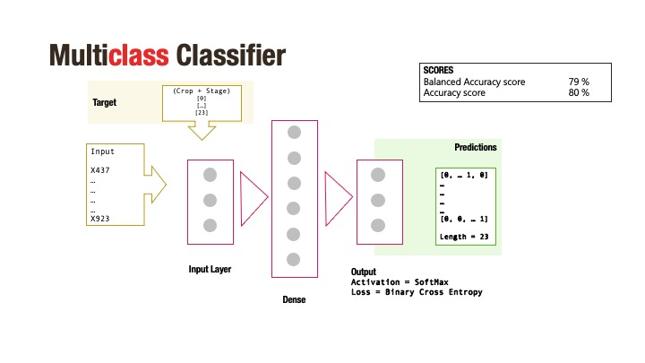
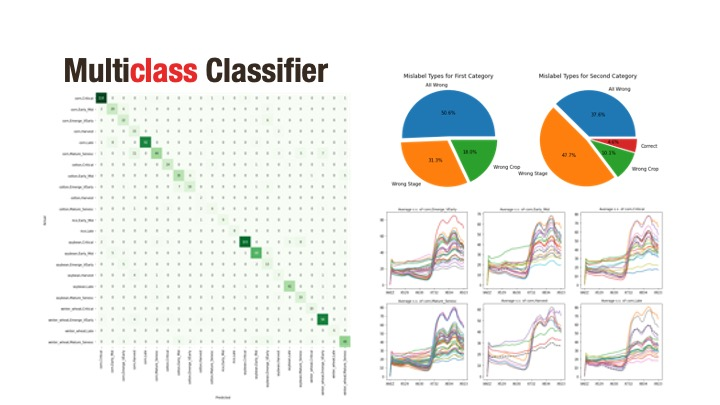

# Capstone
*Marta Ghiglioni*

## Background

Food security is one of the big challenges policy makers worldwide are facing.
To feed 7.4+ billion people sustainably we need high quality data to inform policy makers to drive ultra precision farming at global scale.

Hyperspecral Imaging is a powerful data source that could inform policy making in regards to food security and environmental justice.

### Hyperspecral Imaging for agriculture

_Agricultural crop studies are crucial for global food and water security. Remote sensing data are widely used in cropland studies that include characterization, modeling, mapping, and monitoring cropland extent, areas, watering methods (e.g., irrigated, rainfed, supplemental irrigation), cropping intensities, crop types, crop productivities, crop yields, and crop water productivities. All of this is crucial in food security assessments and management. Croplands account for 80-90% of all human water use. As a result, cropland studies are very important for water security. It is increasingly accepted that hyperspectral data provide a real opportunity to advance cropland studies with significant increases in modeling, mapping, and classification accuracies. Hyperspectral narrowband data also provide “spectral crop signatures” rather than the few spectral data points available from multispectral broadband data. This capability of hyperspectral data provides an opportunity to automate crop signatures for identifying, modeling, and mapping various crop characteristics and their biophysical and biochemical quantities. However, a big drawback is the lack of adequate well-organized hyperspectral libraries of agricultural crops._ 

GHISA for CONUS
Aneece, I. and Thenkabail, P. 2019. Global Hyperspectral Imaging Spectral-library of Agricultural crops (GHISA) for the Conterminous United States (CONUS). User Guide. NASA Land Processes Distributed Active Archive Center (LP DAAC). IP-110217.

For more information [Global Hyperspectral Imaging Spectroscopy of Agricultural-Crops & Vegetation (GHISA)](https://www.usgs.gov/centers/wgsc/science/global-hyperspectral-imaging-spectroscopy-agricultural-crops-vegetation-ghisa?qt-science_center_objects=0#qt-science_center_objects)

## Problem Statement

Is it possible to identify crop types and their development stage uniquely through their spectral signature? 

After reading research papers I decided to attempt to classify crop type and stage using only their spectral signature.

I also decided to focus my research on the first portion of the spectrum (bands 427 – 923). Indeed, these bands are more suitable for a larger scale of applications, easier to collect and  have a higher resolution.

Classes appear to be highly imbalanced, for this reason I decide to use SMOTE. Even though I used SMOTE for some model, I did not apply it to every model, as it would miss to represent the variety of the minority classes and end up overfitting the model eccesively. This was specifically important with Convolutional Neural Network.

## Exploratory Data Analysis
[**Code**](./code/exploratory_data_analysis.ipynb)

## Models
I approached the modeling with three different architectures:
- Multiclass
- Multilabel
- Multitask

And applying supervised learning algoritms:
- Multi-layer Perceptron Classifier
- Convolutional Neural Network
- Chained Classifier (Gradient Boost)

### Multiclass Classifier
[**Code**](./code/multiclass_500_bands.ipynb)

#### Structure

#### Resutls

### Multiclass Chained Classifier
[**Code**](./code/multiclass_chained_500_bands.ipynb)
#### Structure

#### Resutls

### Multilabel Classifier
[**Code**](./code/multilabel_mlp_500_bands.ipynb)
#### Structure

#### Resutls
[structure](./img/mlr.jpeg)

### Multitask Classifier
[**Code**](./code/multitask_cnn_500_bands.ipynb)
#### Structure

#### Resutls

## Conclusion

Multitask is a promising architecture
ICA improves the results on fully connected neural networks, but it impacts negatively convolutional networks.

Spectral data can be incredibly insightful even just using the first 50 bands.

**Next Step** 
- Pull larger data sample, train for results across geographic scope (Central Asia dataset available)
- Pipeline of models, combining strength of different methods
